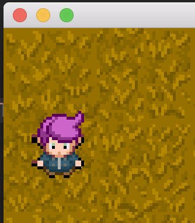

# Farmers Market 

This is a reimplementation of my (very unfinished) game, using C++ and SFML instead of Go and Pixel. I figured it was worth at least trying the standard tools for the job.

See [here](https://github.com/sgoedecke/farmers-market) for my attempt in Go.

Code style is deliberately unidiomatic. For better or worse I'm trying to 'write Go in C++' so I can limit the amount of new things I need to learn at once.

## Screenshot

## Usage

`make` should build a binary called `game`. You'll need to have SFML installed. If you're running macOS, you can probably run the binary I've checked into this repo.

## Todo

* Turn structs into classes with header files - make code more idiomatic
* Add the ability to plant crops
* Add a day/night cycle
* Add an inventory with multiple tools: watering/harvesting/clearing land
* Add text popups to explain stuff
