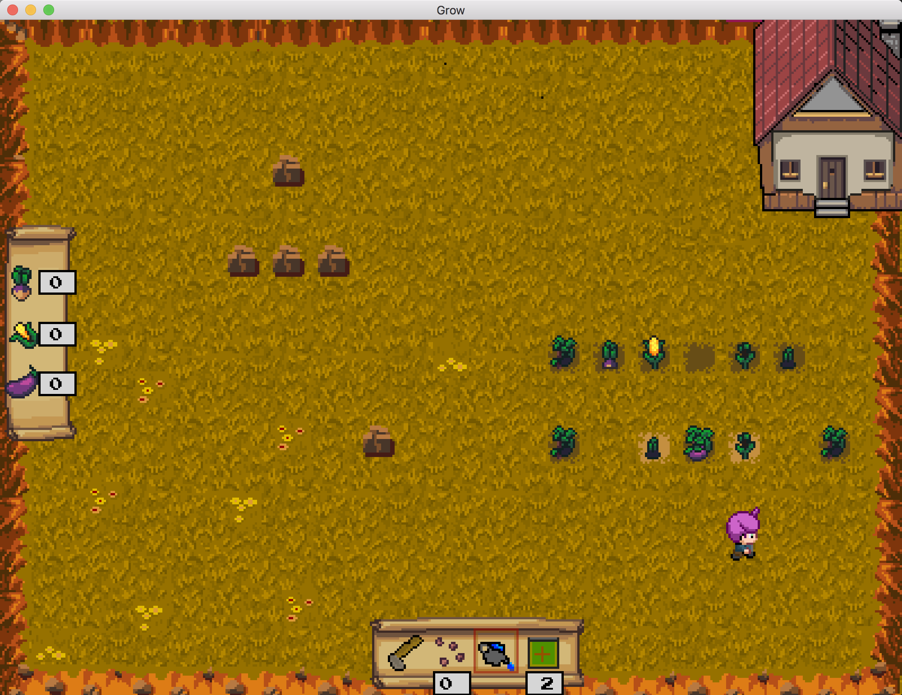

# Farmers Market 

This is a reimplementation of my (very unfinished) game, using C++ and SFML instead of Go and Pixel. I figured it was worth at least trying the standard tools for the job.

See [here](https://github.com/sgoedecke/farmers-market) for my attempt in Go.

Code style is deliberately unidiomatic. For better or worse I'm trying to 'write Go in C++' so I can limit the amount of new things I need to learn at once.

## Screenshot

## Usage

`make` should build a binary called `game`. You'll need to have SFML installed. If you're running macOS, you can probably run the binary I've checked into this repo.

## Todo

- [ ] Turn structs into classes with header files - make code more idiomatic. (Idiomatic code's the only benefit of doing this, I think, since this project's small enough to not require partial compilation).
- [X] Add the ability to plant crops
- [X] Proper crop-planting sprites which mature into different crops
- [X] Harvest crops and store them in the inventory
- [X] Add music and sound effects 
- [X] Add a day/night cycle
- [X] Add an inventory with multiple tools: watering/harvesting/clearing land
- [X] Add text popups to explain stuff
- [X] Add a splash screen 
- [X] Make it so you can't hoe the inventory
- [X] Add animations
- [X] Limit inventory usage
- [X] Add other types of crop that can grow from seeds
- [X] Display harvested crops
- [ ] Handle ENTER on splash screen not skipping menu
- [ ] Stop accidentally advancing the day by running home. Maybe add interior house area?

